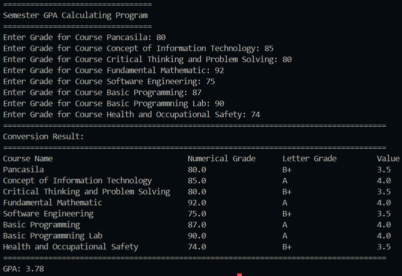

|  | Algorithm and Data Structure |
|--|--|
| NIM | 244107020123 |
| Name |Muhammad Bima Juliansyah|
| Class | TI - 1I |
| Repository | [link] (https://github.com/bimamj/SEMESTER-2-ALSD.git) |

# Labs #1 Programming Fundamentals Review

## 2.1.1. Selection Solution

The solution is implemented in **FinalGradeCalc**.java, and below is screenshot of the result.

  

**Brief explanaton:** There are 4 main step: 
1. Input all grades
2. Validate the input
3. Calculate and convert the final grade
4. Decide the final status

## 2.2.1. Looping Solution

The solution is implemented in **nimLoop.java**, and below is screenshot of the result.

**Brief explanaton:**
1. NIM is inputed as a string
2. The string is then parse into an int variable called n
3. Then using substring and subtracting 2 from the NIM we can check wether the NIM inputed now in n variable is less or more than 10 digits
4. Using substring, it extract the last two digit of the NIM, and if n is less than 10, add 10 value to it by using if function
5. To see the output, we use  for loop
6. Inside the for loop, there's an if function to skip number 6 and 10
7. The output of odd number will be replaced by the '*' character using modulus operation, and the even number will be print out normally
10. This will iterate from 1 until the n number or the last 2 digits of the NIM

## 2.3.1. Array Solution

The solution is implemented in **ipCalculator.java**, and below is screenshot of the result.

**Brief explanaton:**
1. Array containing Course name and it's credit already hardcoded into the program, the user input array numerical grade that is going to be put inside another array for numerical grade, while input for letter grade and it's GPA value will be inputed into each of it's own array using if else and witch function
2. A for loop is used to iterate check on if the grade is valid or not, and
3. Inside the loop there are if else function to check each course with a letter grade grade based on numerical grade the user inputted
4. Switch case function is used to assign each course with it's letter grade 
5. The final GPA is calculated using the formula and the information collected by the program form the user inputs.
6. The output use for loop and padding format to display the result in tabular form.

## 2.3.1. Function Solution

The solution is implemented in **royalGarden.java**, and below is screenshot of the result.

**Brief explanaton:**  
It will be a little bit more complex, because I added few more features

1. Two dimensional array is used to store the stock of each branch. With the row stands for the braches and the column stands for the stock of flower
2. Using a function we calculate the total earning of each branch
3. Then asked the user wether they want to knows how much of the stock remain if there's a reduction (dead flowers)
4. When the user pick a branh (branch 4 from the question) then it will display the remaining stock after reduction

##  ASSIGNMENT 1

The solution is implemented in **carPlate.java**, and below is screenshot of the result.

**Brief explanaton:** 

1. Two array is used, the first to store the car plate code which is one dimensional, the second is 10 by 12 two dimensional char array to contain the name of the city up to twelve character
2. User input the car plate code
3. For loop is used to search for the code in the array
4. If the code is founded then display the city name, if not displays that the code is not found

##  ASSIGNMENT 2

The solution is implemented in **calcCube.java**, and below is screenshot of the result.

**Brief explanaton:** 

1. Inside the main function theres a menu to ask the user to choose between 3 option of calculation volume, surface area and perimeter
2. Using switch case, each of the option run a specific function
3. 1 for volume, 2 for surface are, 3 for perimeter
4. Inside of each of this function ask the user to input the length of it's side, then check wether the input is negative or not, if not it will calculate it with it's each own formula
5. Return the result

## ASSIGNMENT 3

The solution is implemented in **courseManagement.java**, and below is screenshot of the result.

**Explanation:**

1. User input the number of courses they are taking
2. Using loop, the program ask input for semester, sorse name, credit hours, and lecture day, and puts its inside each of their own array
3. After completing the input it will then display the menu from which they can pick.
4. The first menu is a function to display all of the courses and it's details using loop
5. The second is to display course by lecture day. The user inputs the day name and the program will search using loop and display the course if found
6. The third menu is to display course by semester. The user inputs the semester and the program will search using loop and display the course if found
7. The fourth is to search course by name. The user inputs the corse name and the program will search using loop and display the course if found
8. The program will continuously display the menu, to exit user must choose the 5th menu so the program will terminate