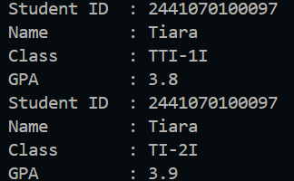

|  | Algorithm and Data Structure |
|--|--|
| NIM | 244107020123 |
| Name |Muhammad Bima Juliansyah|
| Class | TI - 1I |
| Repository | [link] (https://github.com/bimamj/SEMESTER-2-ALSD.git) |

# Labs #2 Object

# 2.1 Experiment 1

### 2.1.2 Verification Experiments Result

  

### 2.1.3 Question Answers
1. Class is like a blueprint or a plan, and you can only declare class once. While object is you can declare it multiple time, it's physical entity
2. Student class has 4 attribute 
<ol>- Student Id</ol>
<ol>- Student name</ol>
<ol>- Class name</ol>
<ol>- GPA</ol>

3. Student class has 4 methods
<ol>- Print</ol>
<ol>- Change class</ol>
<ol>- Update GPA</ol>
<ol>- Evaluate</ol>

4.  
5. The evaluate() method evaluates the student performance by evaluating the value of the students GPA by the parameter given. It returns a String value of either excellent, good, fair and poor

# 2.2 Experiment 2

### 2.2.2 Verification Experiments Result

### 2.2.3 Question Answers
1. 
2. To access an object attributes we use the don notation (.) followed by variable
3. Because the first print() is executed before the changeClass() and updateGPA() ran. So the first print() output is before and the second print() is after the two methods are executed

# 2.3 Experiment 3

## 2.3.2 Verifivation Experiment Result

 

## 2.3.3 Questions Answer

1. 
2. The new Student19 calls the constructor of Student19 class to create a new Student19 object and it will pass the four argument user inputted to the constructor that will be assigned to each attributes
3. If we remove the default constructor, we will get an error message. Because, in StudentMain we call a constructor that need no argument, but in Student19 Class we only provide a constructor that needs 4 argument, that's why it throws an error
4. No, because it works independently unless it needs another result from another methods and will work as long as it has been instantiated

# ASSIGNMENT 1

The implementation is in **Student19.java** & **StudentMain.java**, and this is a screenshot for the result:

**Explanation:**
1. On the Student19.java there's object's attributes, and methods. There are also default constructor and parameterized constructor. Methods to assign the object attributes, methods to print, methods to change credit, and hours.
2. On the CourseMain.java it's the main function where object is instantiated and the attributes is assigned by calling the constructor.

# ASSIGNMENT 2

The implementation is in **Lecturer19.java** & **LecturerMain.java**, and this is a screenshot for the result:

**Explanation:**
1. On the Lecturer19.java there's object's attributes, and methods. There are also default constructor and parameterized constructor. Methods to assign the object attributes, methods to print, methods to change field expertise, active status, and to calculate tenure.
2. On the CourseMain.java it's the main function where object is instantiated and the attributes is assigned by calling the constructor.

