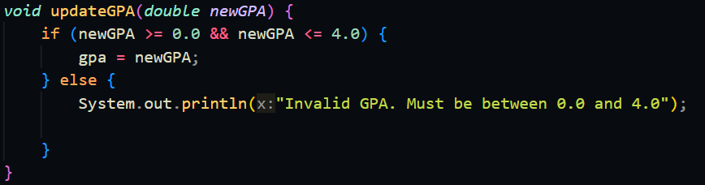

|  | Algorithm and Data Structure |
|--|--|
| NIM | 244107020123 |
| Name |Muhammad Bima Juliansyah|
| Class | TI - 1I |
| Repository | [link] (https://github.com/bimamj/SEMESTER-2-ALSD.git) |

# Labs #2 Object

# 2.1 Experiment 1

### 2.1.2 Verification Experiments Result

  

### 2.1.3 Question Answers
1. Class is like a blueprint or a plan, and you can only declare class once. While object is you can declare it multiple time, it's physical entity
2. Student class has 4 attribute 
<ol>- Student Id</ol>
<ol>- Student name</ol>
<ol>- Class name</ol>
<ol>- GPA</ol>

3. Student class has 4 methods
<ol>- Print</ol>
<ol>- Change class</ol>
<ol>- Update GPA</ol>
<ol>- Evaluate</ol>

4.  
5. The evaluate() method evaluates the student performance by evaluating the value of the students GPA by the parameter given. It returns a String value of either excellent, good, fair and poor

