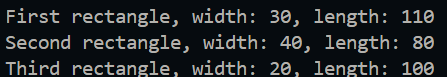
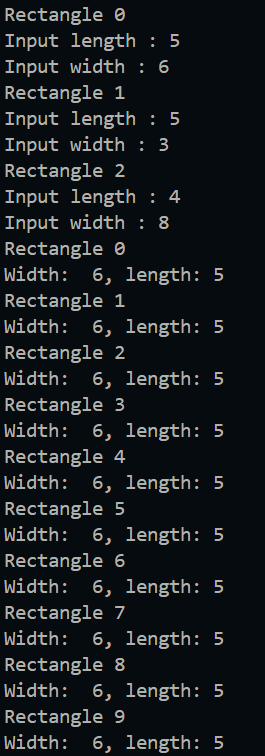
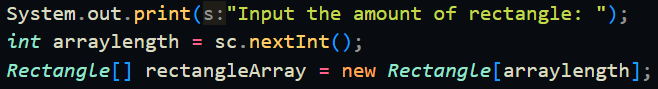
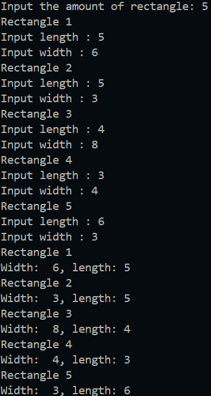

|  | Algorithm and Data Structure |
|--|--|
| NIM | 244107020123 |
| Name |Muhammad Bima Juliansyah|
| Class | TI - 1I |
| Repository | [link] (https://github.com/bimamj/SEMESTER-2-ALSD.git) |

# Jobsheet III Array of Objects

# 1.2 Experiment 1 Create, insert, and display Array of Object

### 1.2.2 Result


### 1.2.3 Questions Answer
1. A class doesn't necesserily need to have attribute and methods, but in this case it will throw an error if we delete the ```Rectangle()``` attributes, because it no longer has length and width, there for we cannot assign the designated value of it's length and width
2. No, but in Java if a class doesn't define a constructor, the java compiler will automaticaly provides a default constructor without any parameter. So we can just instatntiate the object
3. It declares, instantiate, and initialize an array of ```Rectangle``` reference with the size of 3
4. - The first line instantiate a new ```Rectangle``` object in the array index 1
    - The second line assign the ```Rectangle``` in index 1 with the length attribute of 80
    - The third line assign the ```Rectangle``` in index 1 with the width attribute of 80
5. So that we can avoid mixing data representation and logi, we can also reuse the ```Rectangle()``` class in other part of our program if we separate it with ```Array OfObjects``` class. 

# 1.3 Experiment 2 Input data into Array of Objects using Loops

### 1.3.2 Result


### 1.3.3 Questions Answers
1. Yes, array of object can be implemented on 2D array
2. For example we can create a 2D array of student class where the row is for representing different student and the column represents different subject of students
3. Because the object itself has not been intantiated, so the array contains null value 
4.  
5. Yes we can, but this will result in the object to be reassigned a different value, depending whic is written first ```ppArray[0]``` or ```ppArray[i]```, it will result in the old value replace by the new value and is a waste of data
