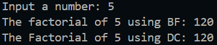

|  | Algorithm and Data Structure |
|--|--|
| NIM | 244107020123 |
| Name |Muhammad Bima Juliansyah|
| Class | TI - 1I |
| Repository | [link] (https://github.com/bimamj/SEMESTER-2-ALSD.git) |

# Jobsheet V Brute Force and Divide and Conquer

# 5.2 Experiment 1 Calculating Factorial Using Brute Force and Divide and Conquer Algorithms

### 5.2.2 Result


### 5.2.3 Questions Answer
1. The ```factorialDC()``` is a recursive function, in the if else structure, it checks wether the value inputed by the user is equal to one or not, if not it will continue to the else funtion wher it will call itself, but intead of using the same value as the user input it wil subtract value of 1 from the input, it will repeat again until its equal to 1
2. We can modify it using `while` or `do-while` loop. If we use `while` a loop will run as long as the conition is true and we can decrement `n` and multiplying `facto`. And if using `do-while` the loop will ensures that it will execute at least once before checking the condition. Example:

```java
int factorialBF(int n) {
    int facto = 1;
    int i = 1;
    while (i <= n) {
        facto *= i;
        i++;
    }
    return facto;
}

int factorialBF(int n) {
    int facto = 1;
    int i = 1;
    do {
        facto *= i;
        i++;
    } while (i <= n);
    return facto;
}
```
3. `facto = facto*i` means that the new falue of `facto` is equal to its old value multiply by `i`, while `int facto = n * factorialDC(n-1)` means that the value of `facto` is equal to `n` multiplied by the result value from recursive function `factorialDC(n-1)`. It can be written like n * (n-1) * (n-2)... * 1 
4. The `factorialBF()` works iteratively looping the value one by one, while `factorialDC()` works by recursion and splitting the problems into smaller subproblems then solving it

