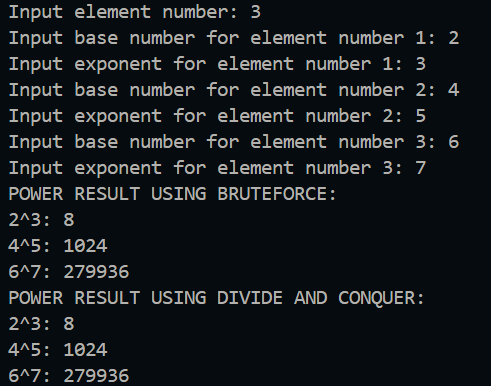
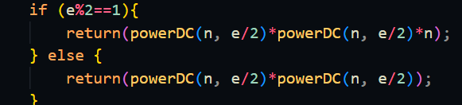
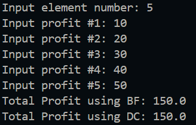
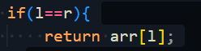

|  | Algorithm and Data Structure |
|--|--|
| NIM | 244107020123 |
| Name |Muhammad Bima Juliansyah|
| Class | TI - 1I |
| Repository | [link] (https://github.com/bimamj/SEMESTER-2-ALSD.git) |

# Jobsheet V Brute Force and Divide and Conquer

# 5.2 Experiment 1 Calculating Factorial Using Brute Force and Divide and Conquer Algorithms

### 5.2.2 Result


### 5.2.3 Questions Answer
1. The ```factorialDC()``` is a recursive function, in the if else structure, it checks wether the value inputed by the user is equal to one or not, if not it will continue to the else funtion wher it will call itself, but intead of using the same value as the user input it wil subtract value of 1 from the input, it will repeat again until its equal to 1
2. We can modify it using `while` or `do-while` loop. If we use `while` a loop will run as long as the conition is true and we can decrement `n` and multiplying `facto`. And if using `do-while` the loop will ensures that it will execute at least once before checking the condition. Example:

```java
int factorialBF(int n) {
    int facto = 1;
    int i = 1;
    while (i <= n) {
        facto *= i;
        i++;
    }
    return facto;
}

int factorialBF(int n) {
    int facto = 1;
    int i = 1;
    do {
        facto *= i;
        i++;
    } while (i <= n);
    return facto;
}
```
3. `facto = facto*i` means that the new falue of `facto` is equal to its old value multiply by `i`, while `int facto = n * factorialDC(n-1)` means that the value of `facto` is equal to `n` multiplied by the result value from recursive function `factorialDC(n-1)`. It can be written like n * (n-1) * (n-2)... * 1 
4. The `factorialBF()` works iteratively looping the value one by one, while `factorialDC()` works by recursion and splitting the problems into smaller subproblems then solving it

# 5.3 Experiment 2 Calculating Exponentiation Using Brute Force and Divide and Conquer Algorithms

### 5.3.2 Result


### 5.3.3 Questions Answer
1. Both method has the same function, that is to calculate n to the power of e. The difference are, `powerBF()` use bruteforce and done iteratively, while `powerDC()` use divide and conquer and done by recursion
2. Yes, the combine stage exist it in this block of code 
3. Yes, the method could be implemented without parameter, because `baseNumber` and `exponent` is already stored as class variable, so we can use this instead. 
4. `powerBF()` use iteration, it use loop to multiply `baseNumber` by itself `exponent` number of times. While,`powerDC()`it uses recursion to split the exponentiation into smaller problems. Reduces the problem size by half each time

# 5.4 Experiment 3 Calculating Array Sum Using Brute Force and Divide and Conquer Algorithms

### 5.4.2 Result


### 5.4.3 Questions Result
1. `mid` variable is needed so that it can divide the problem into 2 smaller subproblems. It helps by dividing the array into 2 halves, left subarray and right sub
2. `totalDC(arr, l, mid)` Recursively computes the sum of the left half of the array (from index `l` to `mid`).
`totalDC(arr, mid+1, r)` Recursively computes the sum of the right half of the array (from index mid+1 to r).
3. It's necessary since it's the combine stage, and returns the total sum for the current segment of the array
4. This is the base case . When the left index `l` is equal to the right index `r`
5. Divide the array into two halves, left and right. Each halves have a recursion function to sum the total. Finally it will returned the combined value of left half and right half. 