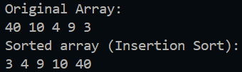
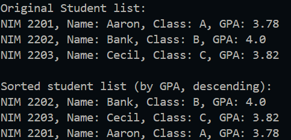
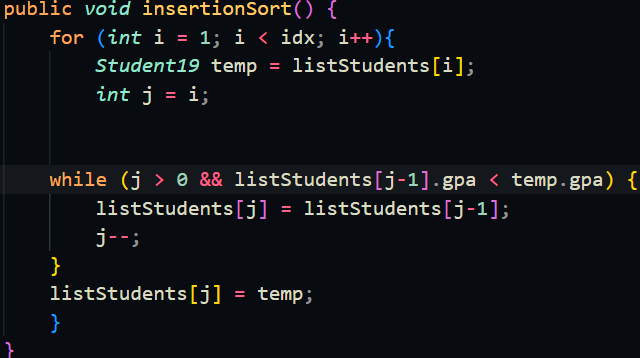

|  | Algorithm and Data Structure |
|--|--|
| NIM | 244107020123 |
| Name |Muhammad Bima Juliansyah|
| Class | TI - 1I |
| Repository | [link] (https://github.com/bimamj/SEMESTER-2-ALSD.git) |

# Jobsheet VI Sorting (Bubble, Selection, and Insertion Sort)

## 6.2 Experiment 1 - Implementing Sorting Using Objects

### 6.2.2 Result

### 6.2.3 Result

### 6.2.4 Result

### 6.2.5 Questions Answer
1. The function of the block of code is to check and compare the value of each index and swap it with each other if the condition is met. The swap is possible because firstly the new value is stored in `temp` after that the old value is swapped.
2. This block of code implements the minimum values search algorithm 
3. The condition means, `j` is bigger than 0, to prevent the first index to be checked again, and `data[j] > key` is to make sure that `j` is bigger than `key` which checked the left index is bigger than the right
4. It is to change or 'swap' the value of right and left index that is being compared.

## 6.3 Experiment 2 - Sorting Using an Array of Objects
### 6.3.3 Result

### 6.3.4 Questions Answer
1. A. We compare adjacent elements and swap them if necessary. After each full pass through the list, the largest unsorted element "bubbles up" to its correct position  
Since we need to compare pairs of elements, we stop one step before the last (`idx - 1`)  
B. In each pass (`i`), the largest remaining unsorted element moves to its correct position at the end  
Once an element is placed correctly, we no longer need to check it in future passes  
This means we reduce the number of comparisons by `i` in each subsequent pass, so we loop until `idx - i - 1`  
C. The outer loop (`i`) runs from `0` to` idx - 1 ` 
Since `idx = 50`, the loop executes 49 times (from `i = 0` to `i = 48`)
2.   
  

### 6.3.8 Result

### 6.3.9 Questions Answer
1. The code snipet is used to find the lowest GPA score in the unsorted part of the array. Once the smallest element is found, it is swapped with the element at index `i`. The sorted part grows, and the unsorted part shrinks.

### 6.3.12 Result

### 6.3.13

# ASSIGNMENT
The implementation can be seen on `Lecturer19.java`, `LecturerData.java`, and `LecturerMain.java`. This is the result  
[Screenshot](img/image12.png)
