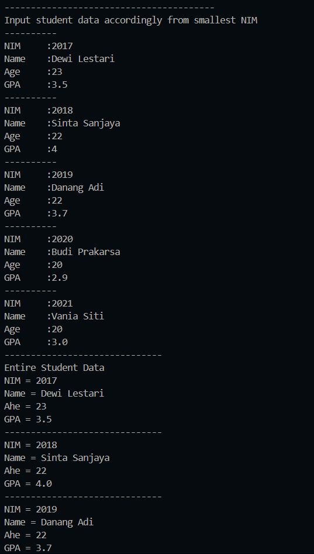
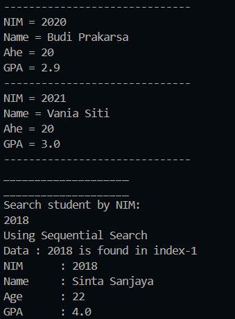

|  | Algorithm and Data Structure |
|--|--|
| NIM | 244107020123 |
| Name |Muhammad Bima Juliansyah|
| Class | TI - 1I |
| Repository | [link] (https://github.com/bimamj/SEMESTER-2-ALSD.git) |

# Jobsheet VII Searching

## 7.2 Experiment 1 -Sequential Search Method

### 7.2.2 Result

### 6.2.3 Questions Answer
1. The difference is `showData()` display the detail of data that is searched, while `showPosition()` only display wether the data is found or not, and the location of the searched data if found
2. It compares the the value of `search` and the value of `listSTD[i].nim` if it is of the smae valu, then it will assign the value of `position` with the value/index of `i`
3. No, the program will not run into an error, and the result will still be correct. Because we use sequential search, it will check every element from the start of the array to the end
4. The `position` is initialized by -1 instead of 0 is because, if the data is not found then it will return the value of -1, which will display that the data is not found. If we initialize it with 0, the program will return value 0, which will tell that the data is located in index 0 which is not correct

