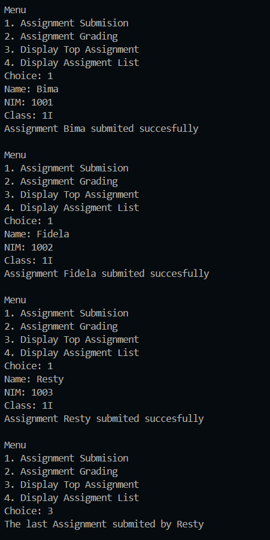
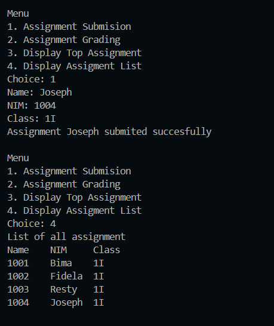
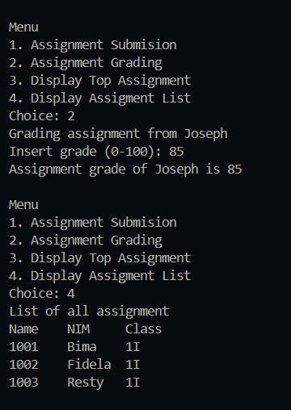
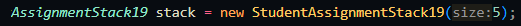
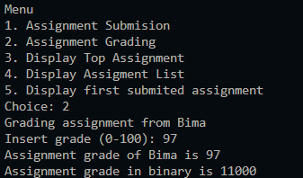
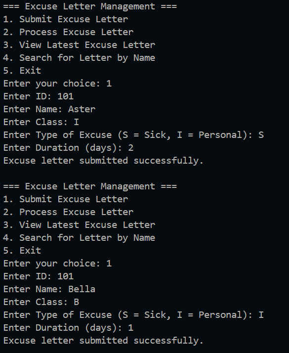
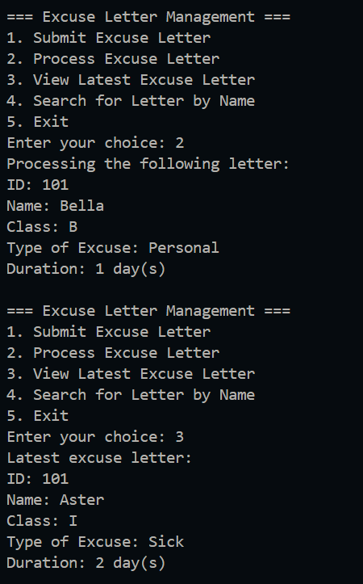
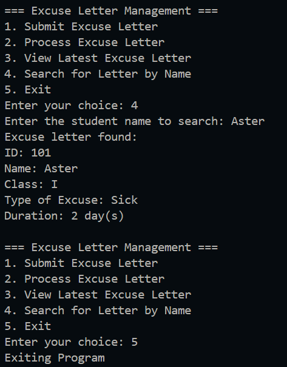

|  | Algorithm and Data Structure |
|--|--|
| NIM | 244107020123 |
| Name |Muhammad Bima Juliansyah|
| Class | TI - 1I |
| Repository | [link] (https://github.com/bimamj/SEMESTER-2-ALSD.git) |

# Jobsheet X Stack

## 2.1 Experiment 1 Assignment Submission
### 2.1.2 Result Verification

### 2.1.3 Questions Answer
1. In the student assignment management system, it is used to grade the students with the system last in first out, so the last person to submit their assignment, they will be graded first to make it easier to grade
2. Push is to add the data to the stack, and pop is to remove the data from the stack after its graded
3. It is used to check wether the stack is full or not. If it doesn't check and the stack is apparently full, it will throws and error
4. There is 5. 
5. Add a method `bottom()` in `StudentAssignmentStack19` In `StudentDemo19`, add a new menu option, choice 5 to call `bottom()` and display the first submitted student's info.
6. We add a new method called `countAssignment`. We can count the number of assignment submited by the number of top. But the top starts at 0, so we return top + 1.
7. Stack is quite simple logic, it is very useful to process the last item first. The real world feature would be like the udno feature in computer program.
## 2.2 Experiment 2 Convert Assignment Grade to Binary
### 2.2.2 Result Verification

### 2.2.3 Quetions Answer
1. `ConvertToBinary()` uses a stack to reverse the remainders of division by 2, so the binary digits are printed in the correct order.
2. The program will still work just fine. Because as long as it is not 0 the program will still be fine. But it is safer to use  > 0, incase pf negative grades being input in

## ASSIGNMENT
The Implementation can be seen on `ExcuseLetter19.java`, `ExcuseLetterStack19.java`, and `ExcuseMain.java`
Result: 

