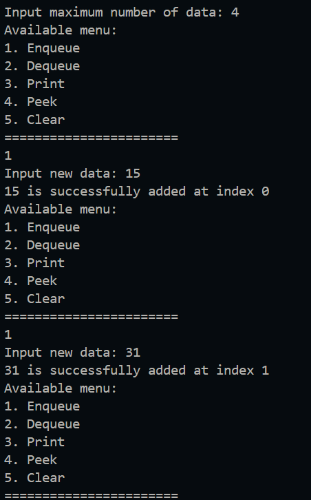
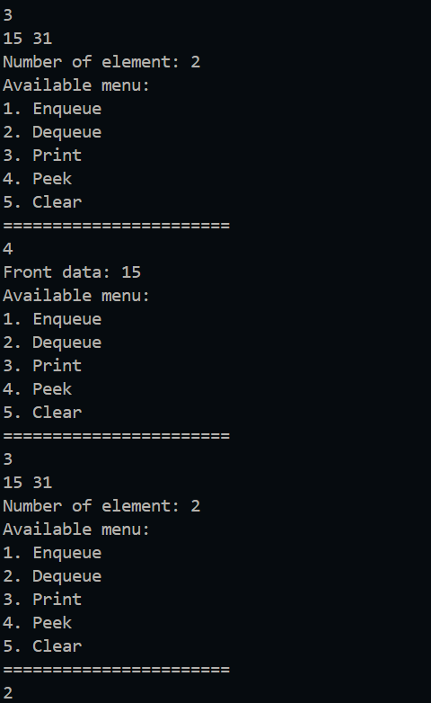
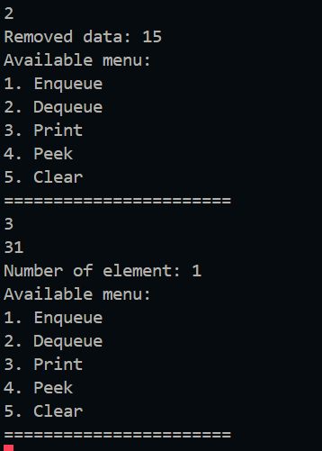
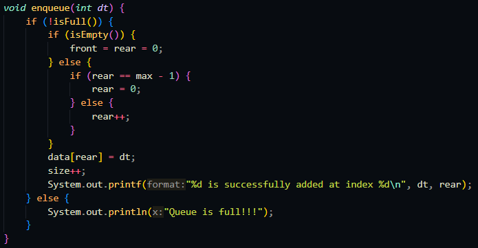
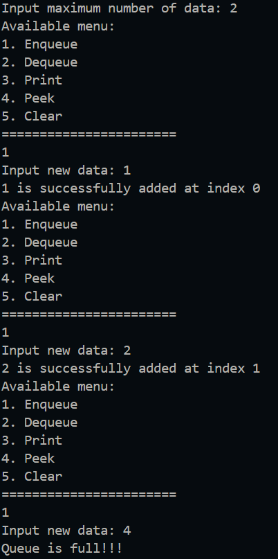
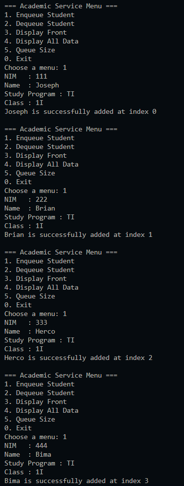
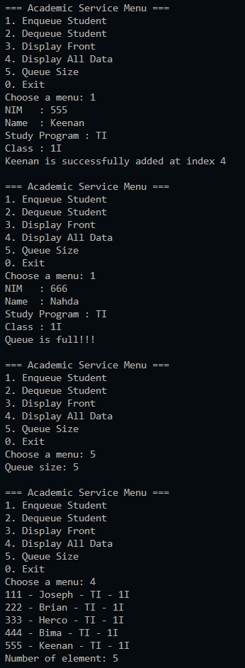
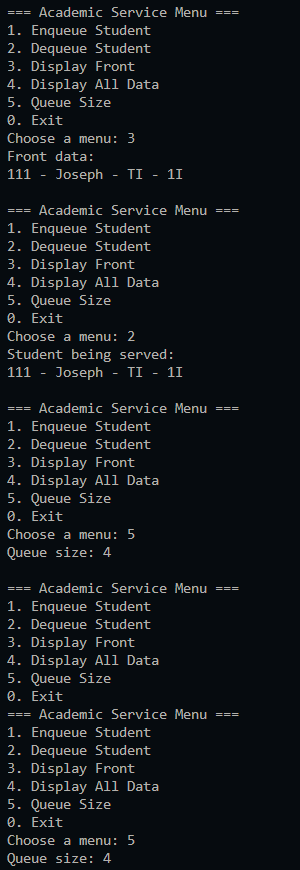
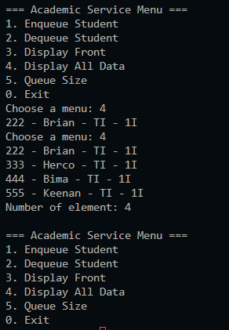
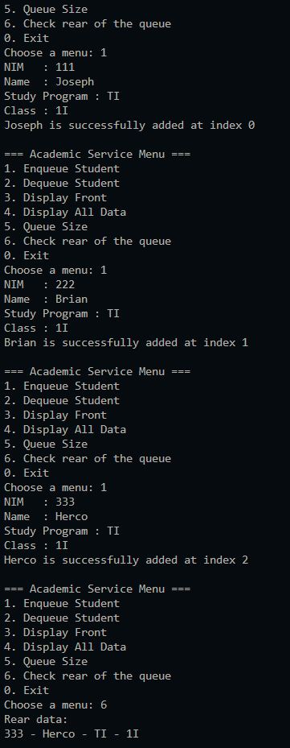

|  | Algorithm and Data Structure |
|--|--|
| NIM | 244107020123 |
| Name |Muhammad Bima Juliansyah|
| Class | TI - 1I |
| Repository | [link] (https://github.com/bimamj/SEMESTER-2-ALSD.git) |

# Jobsheet XI Queue

## 2.1 Experiment 1 Queue Basic Operations
### 2.1.2 Output Verification  

### 2.1.3 Questions Answer
1. `front` and `rear` attributes are set to -1 to indicates that the queue is empty, because the `front` doesn't exist and so di the `rear`. `Size` is set to 0 that there are no element inside of the queue when its first create. When the first element is inserted it will increment `front` and `rear` to 1, and `size` to 0.
2. It is to make sure when the `rear` index reaches the end index, it will wrap around to the front instead of going out of bounds.
3. Similar, it is to make sure when the `front` index reaches the end index, it will wrap around to the front instead of going out of bounds.
4. Because the type of queue we are using is circular, that means it doesn't always start at index 0 because it can wrap aroun, so the correct way is to use `front`.
5. Because we use circular queue, this line increments `i`, and wraps it around to 0 when it reaches max. Without this the loop would go out of bounds.
6.  When the condition for `isFull()` returns true, the program will print that the queue is full
7. 

## 2.2 Experiment 2 Academic Service Queue
### 2.2.2 Output Verification

### 2.2.3 Questions Answers
1. In `Queue` it manages a primitive data type of integer while `StudentQueue` manages `Student` object. This is important, because `Student` object could store information like name, Id etc, instead of simple number
2. The data stored in experiment 2 is stored in the object `Student` it will access the attributes and when dequeing it will return the object so the information is shown in more detail
3. In this experiment we assume that the front starts at index 0 and the first elemet will always be accessed from index 0
4. 

