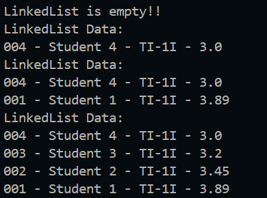
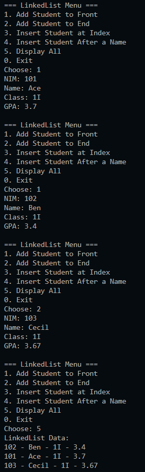
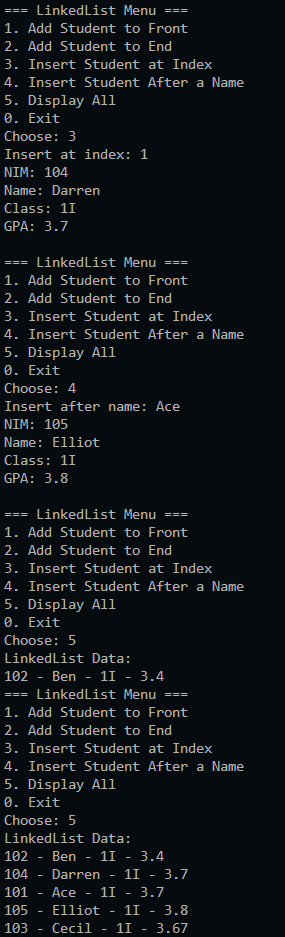
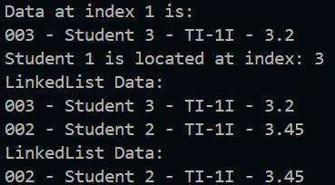

|  | Algorithm and Data Structure |
|--|--|
| NIM | 244107020123 |
| Name |Muhammad Bima Juliansyah|
| Class | TI - 1I |
| Repository | [link] (https://github.com/bimamj/SEMESTER-2-ALSD.git) |

# Jobsheet XII Linked List

## 2.1 Experiment 1 Implementing Single Linked List
### 2.1.2 Output Verification  

### 2.1.3 Questions Answer
1. Because the first command that we write is to print the linkedlist while we have not add any data, so the result is the linkedlist is empty
2. The general purpose is a temporary pointer used to traverse the linked list starting from the head. In `print()` it is used to loop through the list from the head to the tail and print each node’s student data. In `insertAfter(Student std, String key)` it is used to searches through the list to find the node with a name matching key. Once found, it inserts the new node after it. In `insertAt(int index, Student std)` it is used to moves through the list to reach the node just before the target index, so the new node can be inserted at the correct position.
3.   
 
4. If we remove the tail attribute, we will need to traverse to the end everytime when we try to add new data on `addLast()`

## 2.2 Experiment 2 Accessing Element in Single Linked List
### 2.2.2 Output verification

### 2.2.3 Questions Answer
1. The break is used to exit the loop as soon as the target node is found and removed
2. `temp.next = temp.next.next;` is used to remove the node after `temp` by skipping it, then the `if` command will check, if `temp.next == null` it will assign `tail` with the value index of `temp`