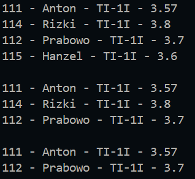

|  | Algorithm and Data Structure |
|--|--|
| NIM | 244107020123 |
| Name |Muhammad Bima Juliansyah|
| Class | TI - 1I |
| Repository | [link] (https://github.com/bimamj/SEMESTER-2-ALSD.git) |

# Jobsheet XIII Double Linked Lists

## 12.2 Experiment 1
### 12.2.1 Activity 1
### 12.2.2 Output Verification

### 12.2.3 Questions Answers
1. Singly linked list only has reference to the next node, while doubly linked list can reference the next and previous node. Singly linked list only allows traversal in a single direction, while doubly linked list can traverse in both direction.
2. `next` is used to point to the next node on the list, and `prev` is used to point to the previous node on the list.
3. It is used to initialize the list to be empty by setting the `head` and `tail` to be null
4. It checks if the list is empty, then the new node becomes the first `head` and first `tail`
5. This connects the existing head's previous pointer to the new node, making the link backward from the old head to the new head.
6. This sets the previous pointer of the node after the insertion point to point back to the new node.
7. 
Traversal occurs in the `insertAfter()` and `print()` methods. `temp = temp.next;` moves the pointer to the next node in the list.
8. It handles the special case when the node you're inserting after is the last node (tail) in the list. If we remove it, there will be an error, because the temp will have value of null, and the `prev` of null is nullpointerexception error
9. Checks whether the current node’s nim matches the key. Used to find the node then the new node should be inserted.
10. Because in `insertAfter()` on the end of the else statement there should be a `break` so that it will immediately exit the loop

## 12.3 Experiment 2
### 12.3.1 Activity 2
### 12.3.2 Output Verification

### 12.3.3 Question Answers
1. `head = head.next;` moves the head ponter to the second node in the list, and `head.prev = null;` removes the previous connection from the new head to the old head
2. This condition handles the case when the list has only one node. If you don't include that, you could end up with references pointing to deleted memory. It ensures the list becomes truly empty (null).
3. If there is no `tail`, we need to use traverse from `head` to the second to last node
4. It prevents the code to access a `null` node and avoid crashing
5. A removal of a node in the begining first chet if the `index == 0` if yes then calls `removeFirst()` if the node is at the last `temp == tail` it will call `removeLast()` toremove `tail`
6. it uses this, `temp.prev.next = temp.next; temp.next.prev = temp.prev;`. This makes the `temp` previous node `.next` skip over `temp`. and makes the next node `.prev` skip over temp
7. 

## ASSIGNMENT
The implementation for the assignment can be seen on `Student.java`, `Node.java`, `DoubleLinkedLists.java`, and `DoubleLinkedListsMain.java`. I have set the data in main to this  
  

### and this is the result after running the program

