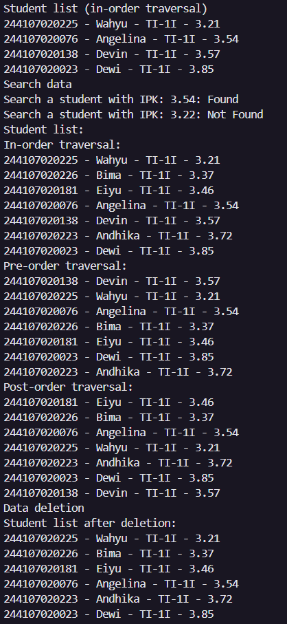

|  | Algorithm and Data Structure |
|--|--|
| NIM | 244107020123 |
| Name |Muhammad Bima Juliansyah|
| Class | TI - 1I |
| Repository | [link] (https://github.com/bimamj/SEMESTER-2-ALSD.git) |

# Jobsheet XIV Tree
## 14.2 Experiment 1
### 14.2.1 Results

### 14.2.2 Question Answers
1. Because binary search tree maintains, a concistent sorted structure where the left child node is always smaller than the parent node, and the right child node is always bigger than the parent node. This allows the tree to search like a sorted array
2. In node class the `left` is used to point to the left child node, while `right` attribute point to the right child node
3a. `root` is the the topmost node, the starting point of the tree, where operation like traverse, add, delete etc starts.
3b. The initial value is set to `null`, meaning the tree is empty
4. If the tree is empty (`root == null`), then a new node containing the data is created. This new node is assigned as the root of the tree. This means the first node added becomes the starting point (`root`) of the entire Binary Search Tree (BST).
5. The general purpose of the code is to correctly position a new student node based on their IPK value by navigating the tree from the root down. If new IPK is smaller, go left:
If left child exists → continue down
If left child is null → insert node here
If new IPK is larger, go right:
If right child exists → continue down
If right child is null → insert node here
6. Locate the node to delete (`current`).
Because it has two children, we need to, replace `current` with a node that preserves the BST property.
The best replacement is the smallest node in the right subtree of current.
Call getSuccessor(current):
Finds the in-order successor.
If `successor` is not current.right, it relocates the `successor`'s right child (if any) properly.
Replace current with `successor`:
`successor.left` = `current.left`
And connect successor to parent of current.
`getSuccesor()` assist by finding the smallest node in the right subtree (in-order successor).
Replaces the deleted node with this successor.
Adjusts pointers to maintain the BST order.

## 14.3 Experiment 3
### 14.3.1 Results

### 14.3.2 Question Answers
1. `data` is an array pf `Student19` objects. `idxLast` keeps track of the last filled index in the 
2. It initializes the binary tree array with a set of student data and updates the index of the last element
3. To perform an in order traversal of the binary tree. Visits left subtree, then root, and then right subtree. Then prints the students in sorted (in-order) sequence if the tree is properly structured.
4. The left child is 5, from 2 * 2 + 1 = 5. While the right child is 6, from 2 * 2 + 2 = 6
5. It indicates that the last index of valid student data in the array is 6 which means the array has 7 elements, from index 0 to 6
6. Because in an array binary tree is mapped like this. For a node at index `i`, left child is at index `2*i + 1` right child is at index `2*i + 2`

## ASSIGNMENT
The implementation can be seen on `BinaryTree19.java`, `BinaryTreeArray19.java`, `BinaryTreeArrayMain19.java`, and `BinaryTreeMain19.java`.
### `addRekursif()`

### `getMinIPK()` and `getMaxIPK()`

### `displayStudentsWithIPKAbove(double threshold)`

### `add(Student data)`

### `traversePreOrder()`

### `BinaryTreeMain19.java` and `BinaryTreeArrayMain19.java`

### Results

